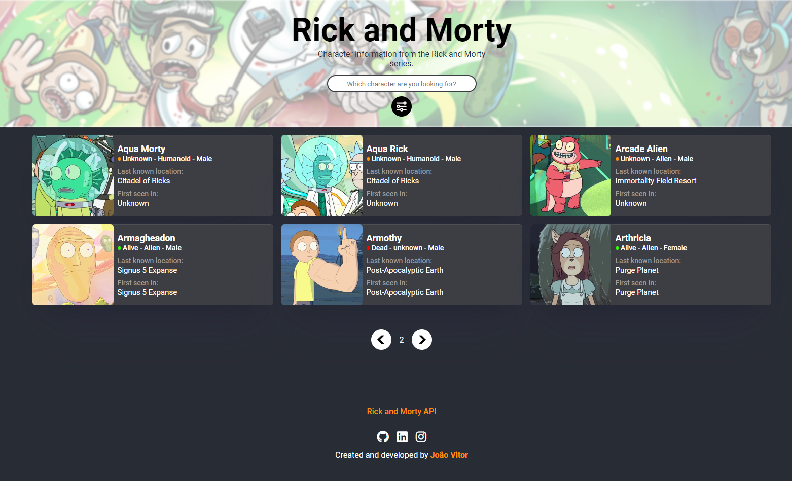

# Rick and Morty Characters</h1>

Desenvolvi esse site sobre personagens de Rick and Morty é uma plataforma que criei para permitir que os fãs da série explorem o universo dos personagens de uma maneira interativa e divertida. Utilizo a API de Rick and Morty para buscar informações detalhadas sobre cada personagem, como o nome, status (se estão vivos, mortos ou com status desconhecido), espécie, gênero e localização.

  <h2>Preview</h2>
  

# Recursos e Funcionalidades 🔎
 - Pesquisar personagens por nome.
 - Filtrar personagens por status, espécie, ou gênero.
 - Navegação paginada entre os resultados.
 - Exibição detalhada das informações de cada personagem.

# Tecnologias Utilizadas 🔧
- Frontend: HTML, CSS, JavaScript
- API: Rick and Morty API

### Acesse:
<a target href="https://jvssvj.github.io/Rick-and-Morty-Characters/" target="_blank">Rick and Morty Characters</a>

## Conecte-se comigo 🔗

  <!--FreecodeCamp--><a href="https://www.freecodecamp.org/jvssvj7" target="_blank" rel="noreferrer"> 
  <!--Frontend Mentor-->
  <!--Linkedin-->
  <!--Instagram-->

